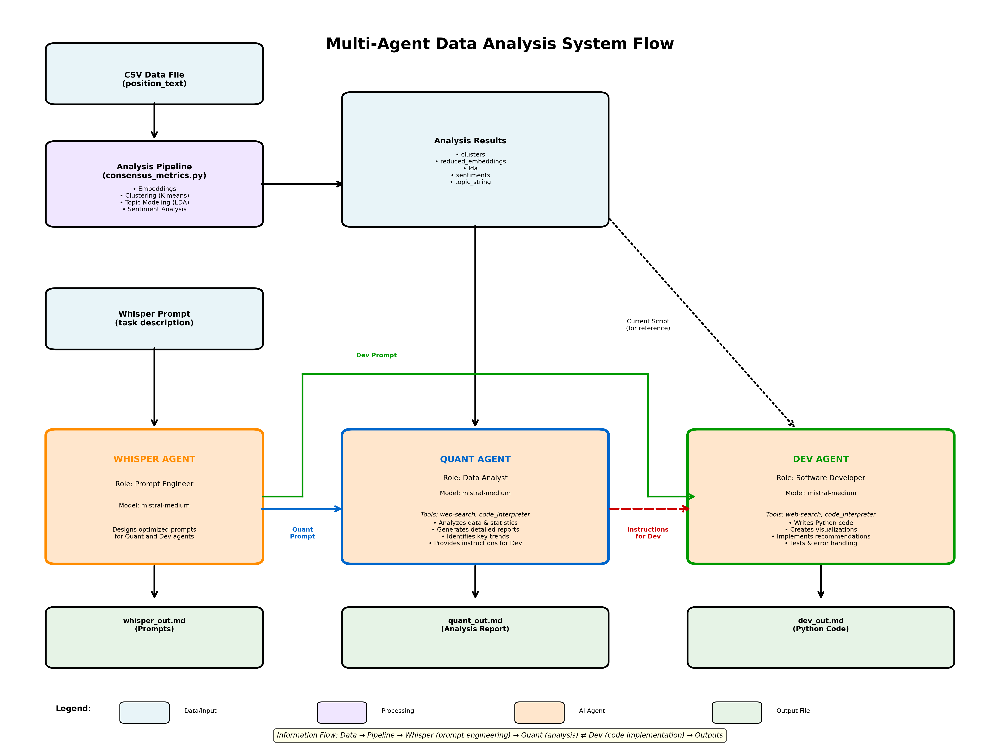

# Mistral Multi-Agent Data Analysis System

A multi-agent data analysis pipeline that combines machine learning techniques with Mistral AI's collaborative agent capabilities to perform clustering, topic modeling, and sentiment analysis on text data. The system uses four specialized agents—Whisper (prompt engineer), Spec (software architect), Dev (software engineer), and Quant (data analyst)—working together to generate comprehensive insights and actionable recommendations.

## Overview

This project is part of a wider initiative around observing, tracking and mapping the underlying structure of deliberative conversations that happen asynchronously via email. The first use case for this has been running series of assemblies deisgned to bring groups of stakeholders to consensus over the content of technical specifications. As the conversations are happening by email, a separate email client captures the response bodies, anonymizes them and decomposes them into discrete "positions" or "ideas". These positions are collected in a csv file for each round of deliberation.

This project processes text data from those 'position' CSV files and generates comprehensive analysis reports using a multi-agent system. It uses Mistral's embedding model to create vector representations of text, applies dimensionality reduction and clustering to identify patterns, performs topic modeling to extract themes, and analyzes sentiment. The results are then processed by four specialized AI agents working collaboratively:

- **Whisper**: Acts as a prompt engineer, designing optimized prompts for the other agents to ensure high-quality outputs and coordinating the team
- **Spec**: A software architect agent that examines the existing analysis script, identifies opportunities for enhancement, and writes technical specifications for additional analyses
- **Dev**: A software engineer agent that implements Spec's technical specifications, writing Python code for visualizations and additional analyses with proper testing and error handling
- **Quant**: A data analyst agent that interprets the results from Dev's code execution, identifies key trends and insights, and generates detailed reports with actionable recommendations

Eventually this will integrate with the email client and other agents such that the assembly can be orchestrated and monitored agentically.

## System Architecture



The diagram above illustrates the complete 4-agent architecture and information flow through the system.

## Features

### Core Analysis Pipeline
- **Text Embedding Generation**: Leverages Mistral's `mistral-embed` model to generate high-quality embeddings
- **Dimensionality Reduction**: Uses t-SNE to reduce embeddings to 3D for visualization
- **Intelligent Clustering**: Automatically determines optimal cluster count using silhouette scores and performs K-means clustering
- **Topic Modeling**: Extracts key topics using Latent Dirichlet Allocation (LDA)
- **Sentiment Analysis**: Analyzes sentiment polarity of text using TextBlob
- **3D Visualization**: Generates interactive 3D cluster maps and sentiment distribution histograms

### Multi-Agent System
- **Collaborative Agent Architecture**: Four specialized agents work together in a coordinated pipeline to provide comprehensive analysis
- **Whisper Agent**: Prompt engineer that designs optimized prompts for Spec and Quant, ensuring clear requirements and high-quality outputs
- **Spec Agent**: Software architect that examines the existing analysis script, identifies enhancement opportunities, and creates technical specifications for Dev to implement
- **Dev Agent**: Software engineer that implements Spec's technical specifications, writing production-ready Python code with visualizations, tests, and error handling
- **Quant Agent**: Data analyst that interprets results from Dev's code execution, generating detailed reports (300-1000 words) with key insights, trends, and statistical analysis
- **Agent Tools**: Spec and Quant have access to web search tools; Dev has code interpreter for executing and validating implementations

## Prerequisites

- Python 3.10+
- Mistral API key (sign up at [Mistral AI](https://mistral.ai))
- CSV file with a `position_text` column containing text data to analyze (example file provided)

## Installation

1. Clone the repository:
```bash
git clone <repository-url>
cd mistral-data-agent
```

2. Install dependencies using conda (recommended):
```bash
conda env create -f environment.yml
conda activate mistral
```

Or install using pip:
```bash
pip install -r requirements.txt
```

### Key Dependencies
- `mistralai` - Mistral AI SDK for embeddings and agent API
- `pandas` - Data manipulation
- `numpy` - Numerical computing
- `matplotlib` - Data visualization
- `scikit-learn` - Machine learning algorithms (t-SNE, K-means, LDA)
- `textblob` - Sentiment analysis
- `python-dotenv` - Environment variable management

## Configuration

1. Create a `.env` file in the project root:
```bash
cp .env.example .env
```

2. Add your Mistral API key and data file path:
```
MISTRAL_API_KEY=your_api_key_here
FILE_PATH=/path/to/your/data.csv
```

The CSV file must contain a column named `position_text` with the text data to analyze.

### Handling Large CSV Files

The system automatically handles different file sizes using a three-tier approach:

- **< 50KB**: Full dataset passed to Dev agent
- **50KB - 500KB**: Random sample (500 rows by default) passed to Dev agent
- **> 500KB**: Summary statistics and sample texts passed instead of raw data

For large files, you can adjust thresholds in `main.py`:
```python
FULL_DATA_THRESHOLD = 50000      # Increase to pass more full data
SAMPLE_DATA_THRESHOLD = 500000   # Increase to allow larger samples
SAMPLE_SIZE = 500                # Increase sample size (e.g., 1000 rows)
```

**See [LARGE_FILES.md](LARGE_FILES.md) for detailed guidance on analyzing large datasets.**

## Usage

### Run the Full Multi-Agent System (Recommended)

To run the complete multi-agent pipeline:

```bash
python main.py
```

This orchestrates the following workflow:

1. **Whisper Agent**:
   - Receives instructions from `prompts/whisper_message.txt`
   - Designs optimized prompts for Spec and Quant agents
   - Outputs results to `outputs/whisper_out.md`
2. **Spec Agent**:
   - Receives the prompt designed by Whisper and the existing analysis script (`consensus_metrics.py`)
   - Examines the script to understand its data analysis capabilities (embeddings, clustering, topics, sentiment)
   - Identifies opportunities for enhancement, bug fixes, or deeper analysis
   - Writes a technical specification for Dev to implement
   - Outputs specification to `outputs/specification.md`
3. **Dev Agent**:
   - Receives the technical specification from Spec and the `consensus_metrics.py` script
   - Executes the existing analysis code (embeddings, clustering, topic modeling, sentiment analysis)
   - Implements Spec's enhancements and extensions with production-ready Python code
   - Uses code interpreter to run all code and generate outputs (data, visualizations, results)
   - Outputs code and execution results to `outputs/dev.md`
4. **Quant Agent**:
   - Receives the execution results and data from Dev's code interpreter
   - Analyzes clusters, embeddings, topics, sentiments, and any additional analyses
   - Generates a comprehensive report with insights, trends, and actionable recommendations
   - Outputs analysis report to `outputs/quant_out.md`

### Standalone Analysis Script (Optional)

You can also run the core analysis script independently for testing or development:

```bash
python consensus_metrics.py
```

This will execute only the baseline analysis (embeddings, clustering, topic modeling, sentiment) and display visualizations, but won't involve the agent system. However, in production use, the Dev agent executes this script along with any enhancements.

## Project Structure

```
mistral-data-agent/
├── consensus_metrics.py       # Core analysis pipeline (embeddings, clustering, topics, sentiment)
├── main.py                    # Multi-agent orchestration script
├── agents/
│   └── agents.py              # Agent initialization and configuration
├── prompts/
│   └── whisper_message.txt    # Initial instructions for Whisper agent
├── outputs/
│   ├── whisper_out.md         # Whisper's designed prompts for Spec and Quant
│   ├── specification.md       # Spec's technical specification for Dev
│   ├── dev.md                 # Dev's code implementation and execution results
│   ├── quant_out.md           # Quant's analysis report
│   └── summary_report_example.md  # Example output from earlier single-agent version
├── requirements.txt           # Python dependencies
├── environment.yml            # Conda environment specification
├── .env                       # Environment configuration (not in git)
├── .gitignore                 # Git ignore rules
├── LARGE_FILES.md             # Guide for handling large CSV files
└── README.md                  # This file
```

## Output

### Multi-Agent System Output

The multi-agent system (`main.py`) generates markdown files in the `outputs/` directory:

1. **whisper_out.md**: Contains two carefully engineered prompts
   - **PROMPT FOR SPEC**: Instructions for the software architect to examine the existing script, identify enhancement opportunities, and create technical specifications
   - **PROMPT FOR QUANT**: Detailed instructions for the data analyst to interpret execution results and generate comprehensive reports

2. **specification.md**: Technical specification document including:
   - **Analysis of Existing Script**: Review of current capabilities and limitations
   - **Enhancement Opportunities**: Identified areas for improvement, additional analyses, and visualizations
   - **Technical Specifications**: Detailed requirements for Dev to implement, including data structures, algorithms, and output formats
   - **Code Snippets**: Hints and examples for implementation, especially for complex or unusual aspects
   - **Recommendations**: Prioritized list of enhancements with rationale

3. **dev.md**: Implementation and execution documentation including:
   - **Execution of `consensus_metrics.py`**: Results from running the core analysis pipeline (embeddings, clustering, topic modeling, sentiment)
   - **Enhanced Code**: Production-ready code implementing Spec's technical specifications and enhancements
   - **Execution Results**: Complete output from code interpreter including:
     - Cluster data and metrics (optimal cluster count, silhouette scores, groupings)
     - Reduced embeddings for visualization
     - Topic modeling results (LDA topics, keywords)
     - Sentiment analysis data (polarity scores, distributions)
     - Additional analyses and visualizations per Spec's recommendations
   - **Code Documentation**: Inline comments, docstrings, and usage examples
   - **Test Cases**: Validation logic and error handling
   - **Generated Outputs**: Saved figures, data files, and visualization outputs in `outputs/` directory

4. **quant_out.md**: Comprehensive analysis report (300-1000 words) including:
   - **Results Analysis**: Interpretation of data and visualizations generated by Dev's code
   - **Key Insights**: Trends, patterns, and significant findings
   - **Statistical Summary**: Distribution metrics, correlations, and statistical tests
   - **Actionable Recommendations**: Concrete next steps, areas for further investigation, and strategic insights

See `outputs/summary_report_example.md` for a sample output from the earlier single-agent version.

## How It Works

The system operates through a coordinated 4-agent pipeline:

### 1. Whisper (Prompt Engineering):
   - Reads the initial task description from `prompts/whisper_message.txt`
   - Analyzes the requirements for both Spec and Quant agents
   - Designs two optimized prompts with specific instructions, output formats, and quality standards
   - Uses delimiters ("PROMPT FOR SPEC" and "PROMPT FOR QUANT") to separate prompts for programmatic extraction

### 2. Spec (Software Architecture):
   - Receives Whisper's prompt and the `consensus_metrics.py` analysis script
   - Examines the script to understand its data analysis capabilities:
     - Text embedding generation using Mistral's `mistral-embed` model
     - Dimensionality reduction with t-SNE
     - Optimal clustering with K-means (using silhouette scores)
     - Topic modeling with LDA
     - Sentiment analysis with TextBlob
   - Identifies opportunities for enhancement: bug fixes, additional analyses, improved visualizations, or deeper insights
   - Writes a detailed technical specification for Dev to implement
   - Includes code snippets, architectural guidance, and prioritized recommendations

### 3. Dev (Software Engineering & Execution):
   - Receives the technical specification from Spec and the `consensus_metrics.py` script
   - **Executes the core analysis pipeline**:
     - Loads data from CSV file (extracts `position_text` column)
     - Generates embeddings using Mistral's embedding model
     - Performs dimensionality reduction, clustering, topic modeling, and sentiment analysis
   - **Implements Spec's enhancements** with production-ready Python code:
     - Enhanced visualizations (interactive plots, heatmaps, comparison charts)
     - Additional statistical analyses (correlation tests, significance testing)
     - Data transformations and feature engineering
   - Uses code interpreter to execute all code and generate outputs
   - Validates results and handles errors
   - Saves all outputs (figures, data files, analysis results) to the `outputs/` directory
   - Returns execution results including data, visualizations, and computed metrics

### 4. Quant (Data Analysis & Reporting):
   - Receives execution results and data from Dev's code interpreter
   - Analyzes the complete set of outputs:
     - Cluster distributions, cohesion metrics, and grouping patterns
     - Topic themes, keywords, and topic-cluster relationships
     - Sentiment distributions, statistics, and correlations
     - Any additional analyses performed by Dev
   - Interprets the visualizations, statistical results, and transformed data
   - Performs deep analysis to identify trends, patterns, and insights
   - Generates a comprehensive report (300-1000 words) with:
     - Results interpretation and key findings
     - Statistical summary and significance assessment
     - Actionable recommendations and strategic insights
   - Provides context-aware analysis grounded in the actual data

### Agent Coordination

The agents work in a sequential pipeline with clear handoffs:
- **Whisper** orchestrates the workflow by designing clear, optimized prompts for Spec and Quant
- **Spec** bridges requirements and implementation by examining the existing analysis script and creating detailed technical specifications for enhancements
- **Dev** executes all code (both the existing `consensus_metrics.py` script and Spec's enhancements) using code interpreter, generating comprehensive data outputs
- **Quant** analyzes Dev's execution results to extract insights and provide strategic recommendations
- All outputs use markdown format with specific delimiter patterns for programmatic processing

**Key Difference**: Unlike traditional pipelines where analysis runs separately, Dev agent is the sole executor of all Python code, ensuring unified execution and result handling.
